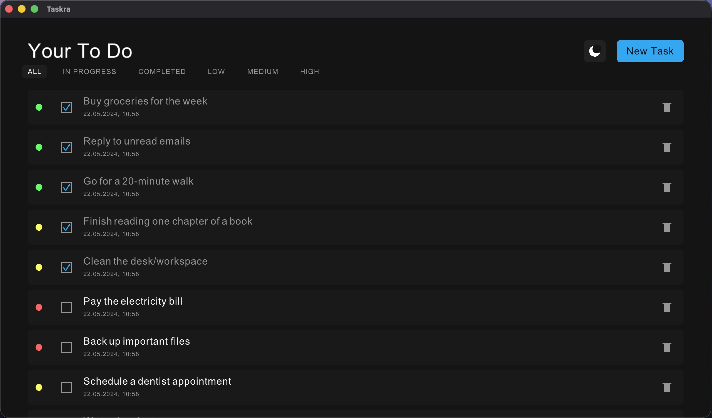
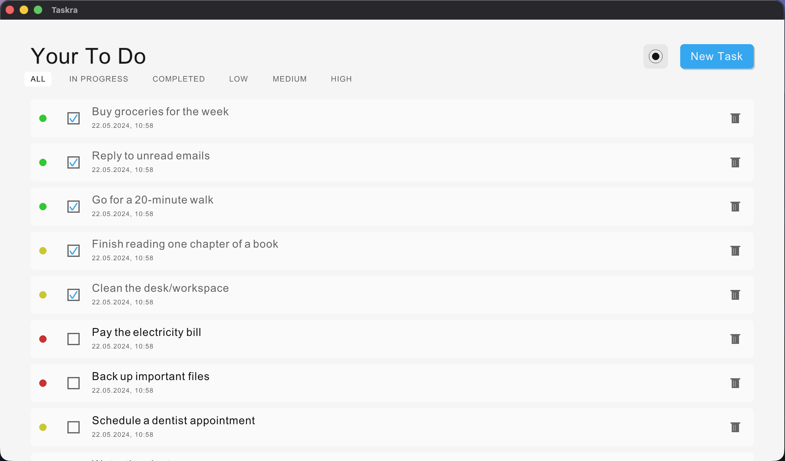
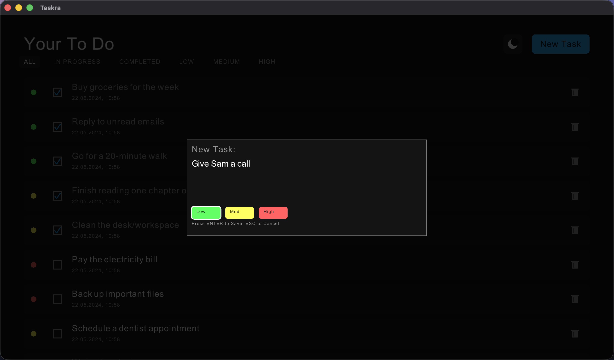

# Taskra



Taskra is a lightweight, efficient To-Do application built from scratch using the **Odin** programming language and **Raylib**. 

I built this project to learn how to structure a UI application in Odin without relying on heavy external UI frameworks. It demonstrates how to implement a custom immediate-mode style UI, handle input, render variable-height text, and manage application state manually.

Special thanks to `cococry` UI is havely inspired by their **[todo](https://github.com/cococry/todo)** repo

## Showcase

https://github.com/user-attachments/assets/e18b2405-142a-44ac-bcd2-07dd1e61392b





## Features

*   **Task Management**: Create, complete, and delete tasks easily.
*   **Priorities**: Assign Low, Medium, or High priority to tasks, visualizing them with color-coded indicators.
*   **Filtering**: Filter tasks by status (All, In Progress, Completed) or priority level.
*   **Dark/Light Mode**: Toggle between a sleek dark theme and a clean light theme.

## Technology Stack

*   **Language**: [Odin](https://odin-lang.org/)
*   **Graphics**: [Raylib](https://www.raylib.com/) (using Odin's `vendor:raylib`)

## How to Run

1.  Ensure you have the **Odin** compiler installed.
2.  Clone this repository.
3.  Run the build script:

```bash
./build.sh run
```

This will compile the project and launch the application.

## Project Structure

*   `src/app.odin`: Main application entry point and state management.
*   `src/model/`: Data structures and JSON storage logic.
*   `src/ui/`: Custom UI rendering, input handling, and layout calculations.
*   `assets/`: Fonts and other resources.
